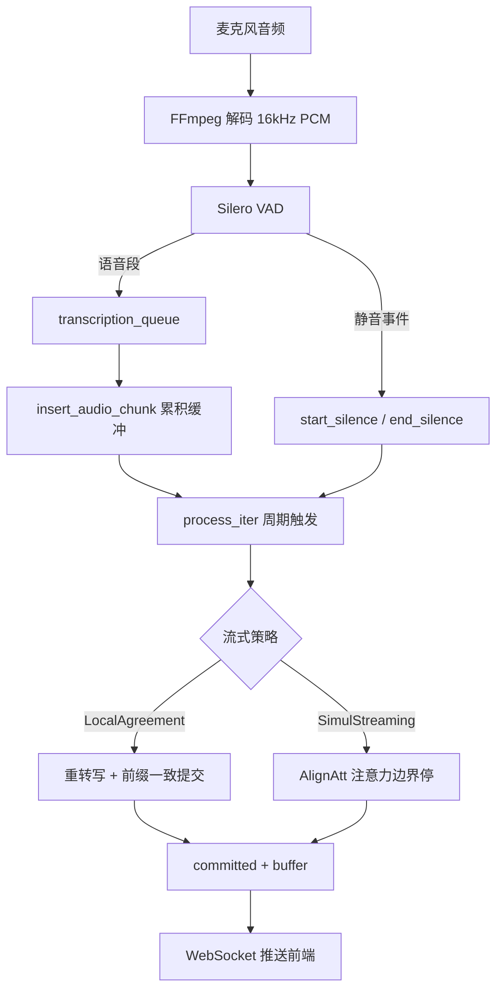
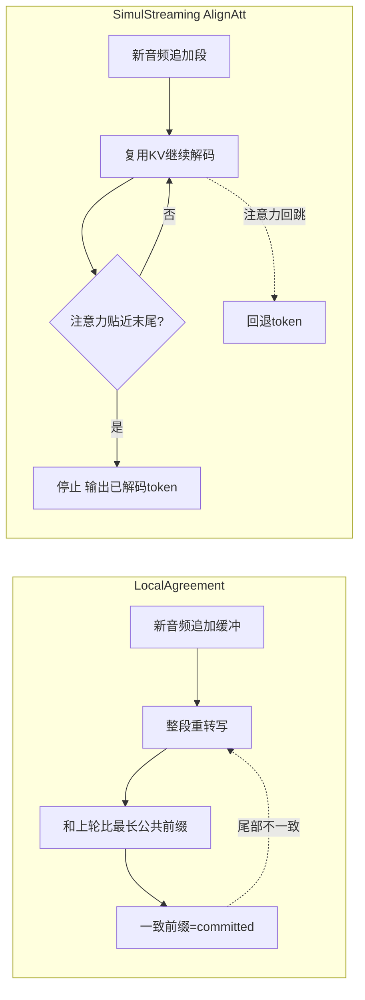

# WhisperLiveKit 流式机制详解

本文档基于 `main` 分支代码，先复核 `qwen3-vllm` 后端的结论，再重点拆解 **Whisper 的两种流式策略**（LocalAgreement 与 SimulStreaming/AlignAtt），并给出整体音频管线、流程图与举例。

---

## 0. 结论复核（qwen3-vllm）

复核 `whisperlivekit/qwen3_vllm_asr.py`（main 分支），此前结论仍成立：

> 它**不是严格意义的真流式推理**，而是「**在线批量重转写 + ForcedAligner 对齐 + 250ms holdback 提交**」。

模块自述已经写明这一点：

```1:8:whisperlivekit/qwen3_vllm_asr.py
"""
Qwen3-ASR backend using vLLM's in-process GPU runtime.

This backend does not use vLLM's HTTP or WebSocket APIs. It keeps one vLLM
engine alive for Qwen3-ASR transcription and another one for Qwen3-ForcedAligner
timestamp prediction. Streaming is implemented by re-transcribing the current
audio buffer and committing only aligned words outside the last 250 ms.
"""
```

关键参数（每 ≥1s 新音频触发一次，窗口最长 30s，末尾 250ms 暂不提交）：

```428:433:whisperlivekit/qwen3_vllm_asr.py
    SAMPLING_RATE = 16_000
    _HOLDBACK_SECONDS = 0.250
    _MIN_NEW_SECONDS = 1.0
    _MAX_BUFFER_SECONDS = 30.0
    _TRIM_BEFORE_COMMITTED_SECONDS = 2.0
```

即：把当前音频缓冲整段重新送进模型（不是只处理新增音频，也没有跨轮 KV/状态复用），靠「时间戳 + holdback」决定哪些词稳定可输出。

---

## 1. 三种策略总览

WhisperLiveKit 把「ASR 模型」和「流式策略（online processor）」解耦。同一个 Whisper 模型可以挂在不同策略下。

| 策略 | 代表后端 | 核心思想 | 是否复用解码状态 |
|---|---|---|---|
| **LocalAgreement** | `whisper` / `faster-whisper` / `qwen3`(LA) | 重转写增长缓冲，连续两次结果一致的前缀才提交 | 否（每次重跑） |
| **SimulStreaming (AlignAtt)** | `simulstreaming` | 边解码边看交叉注意力，注意力贴近音频末尾就停 | 是（KV cache + context） |
| **批量重转写 + 对齐** | `qwen3-vllm` | 重转写整段 + ForcedAligner 时间戳 + 250ms holdback | 否（每次重跑） |

「Whisper 的流式机制」主要指前两种，下面分别详解。

---

## 2. 公共音频管线

不论哪种策略，前置的音频管线是一样的（`audio_processor.py`）：

```
浏览器麦克风
   │  (WebM/Opus 或裸 PCM)
   ▼
FFmpeg 解码 ──► 16kHz mono PCM
   │
   ▼
Silero VAD（语音活动检测）
   │  把音频切成「语音段」与「静音段」
   ▼
transcription_queue（异步队列）
   │
   ▼
online processor.insert_audio_chunk()  # 累积进缓冲
online processor.process_iter()        # 周期性触发推理
   │
   ▼
committed tokens（已确认）+ buffer（未确认）──► WebSocket ──► 前端
```

要点：
- VAD 检测到 **静音开始** → 调 `start_silence()`（flush 当前缓冲）；**静音结束** → `end_silence()`（推进时间偏移）。
- 长静音（≥5s）会重置该段状态，开启新的「utterance」。
- `process_iter()` 不是每个音频包都重推，而是有「至少新增多少音频」的节流阈值。



---

## 3. LocalAgreement（本地一致性）

代码：`whisperlivekit/local_agreement/online_asr.py`（`HypothesisBuffer` + `OnlineASRProcessor`）。

### 3.1 核心思想

Whisper 本身是「整段音频→整段文本」的离线模型。LocalAgreement 用一个朴素但有效的办法把它变流式：

1. 维护一个不断增长的音频缓冲 `audio_buffer`。
2. 每次 `process_iter()` 把**整个缓冲**重新转写一遍，得到新的假设（hypothesis）。
3. 把「上一次的假设」和「这一次的假设」对齐，**取两者相同的最长前缀**作为「已确认（committed）」。
4. 不一致的尾部留在 buffer 里，等更多音频到来再确认。
5. 当确认文本足够长 / 缓冲超时，就在句子或段边界裁剪音频缓冲（`chunk_at`），避免缓冲无限增长。

直觉：模型对同一段话「连续两次都这么转写」，就认为这部分稳定了，可以输出；只出现一次的尾部可能随上下文变化而改写，先不输出。

### 3.2 关键代码

确认逻辑（最长公共前缀）：

```59:86:whisperlivekit/local_agreement/online_asr.py
    def flush(self) -> List[ASRToken]:
        """
        Returns the committed chunk, defined as the longest common prefix
        between the previous hypothesis and the new tokens.
        """
        committed: List[ASRToken] = []
        while self.new:
            current_new = self.new[0]
            if self.confidence_validation and current_new.probability and current_new.probability > 0.95:
                committed.append(current_new)
                ...
            elif not self.buffer:
                break
            elif current_new.text == self.buffer[0].text:
                committed.append(current_new)
                ...
            else:
                break
        self.buffer = self.new
        self.new = []
        self.committed_in_buffer.extend(committed)
        return committed
```

每轮重转写整段缓冲：

```218:233:whisperlivekit/local_agreement/online_asr.py
    def process_iter(self) -> Tuple[List[ASRToken], float]:
        ...
        res = self.asr.transcribe(self.audio_buffer, init_prompt=prompt_text)
        tokens = self.asr.ts_words(res)
        self.transcript_buffer.insert(tokens, self.buffer_time_offset)
        committed_tokens = self.transcript_buffer.flush()
        self.committed.extend(committed_tokens)
```

缓冲裁剪（句子/段边界）：`chunk_completed_sentence()` / `chunk_completed_segment()` → `chunk_at(time)`。

### 3.3 举例

假设用户说："今天天气很好我们去公园"，音频每秒到一块。

| 时刻 | 重转写整段结果（hypothesis） | 与上轮公共前缀 → committed | buffer（未确认） |
|---|---|---|---|
| t=2s | `今天 天气` | （首轮无对比，全留 buffer） | `今天 天气` |
| t=3s | `今天 天气 很好` | `今天 天气` ✅ 提交 | `很好` |
| t=4s | `今天 天气 很好 我们` | `很好` ✅ 提交 | `我们` |
| t=5s | `今天 天气 很好 我们 去公园` | `我们` ✅ 提交 | `去公园` |
| finish | — | flush `去公园` | 空 |

特征：**稳定、纠错能力强**（尾部可被改写），但**延迟相对高**（要等"连续两次一致"），且每轮整段重跑，算力随缓冲变长而增加。

---

## 4. SimulStreaming（AlignAtt 注意力对齐）

代码：`whisperlivekit/simul_whisper/`，核心策略在 `align_att_base.py` 的 `infer()`。这是 WhisperLiveKit 默认的 `--backend-policy simulstreaming`。

### 4.1 核心思想

利用 Whisper **解码器对编码器的交叉注意力（cross-attention）**：解码每个文本 token 时，注意力会「指向」它正在转写的那一帧音频。AlignAtt 的策略是：

- 一边自回归解码 token，一边看「当前 token 注意力最关注的音频帧」`most_attended_frame`。
- 如果这个帧**已经逼近当前可用音频的末尾**（`content_mel_len - most_attended_frame <= frame_threshold`），说明再往下解码就是在「猜还没收到的音频」，于是**停止本轮解码**，等更多音频。
- 如果注意力**突然往回跳**（rewind，超过 `rewind_threshold`），说明解码跑偏了，**回退**已生成 token。
- 与 LocalAgreement 不同，它**复用 KV cache 和 context**，跨轮继续解码，不需要每次从头重跑整段。

直觉：模型"看着音频说话"，说到"音频快没了"就停下等下一段，而不是硬编一个完整句子。

### 4.2 关键代码（边界停 / 回退）

```272:279:whisperlivekit/simul_whisper/align_att_base.py
            if content_mel_len - most_attended_frame <= (
                4 if is_last else self.cfg.frame_threshold
            ):
                logger.debug(
                    f"attention reaches the end: {most_attended_frame}/{content_mel_len}"
                )
                current_tokens = current_tokens[:, :-1]
                break
```

```252:268:whisperlivekit/simul_whisper/align_att_base.py
            # Rewind check
            if (
                not is_last
                and self.state.last_attend_frame - most_attended_frame
                > self.cfg.rewind_threshold
            ):
                ...
                    self.state.last_attend_frame = -self.cfg.rewind_threshold
                    current_tokens = self._rewind_tokens()
                    break
            else:
                self.state.last_attend_frame = most_attended_frame
```

时间戳来自注意力帧（每帧 0.02s）：

```241:245:whisperlivekit/simul_whisper/align_att_base.py
            absolute_timestamps = [
                (frame * 0.02 + self.state.cumulative_time_offset)
                for frame in frames_list
            ]
```

### 4.3 举例

仍以 "今天天气很好我们去公园" 为例，`content_mel_len` 表示「当前已收到音频的总帧数」。

| 时刻 | 已收到音频帧 | 解码到的 token | 注意力最关注帧 | 判断 |
|---|---|---|---|---|
| t=2s | 100 帧 | 今天→天气 | 第 95 帧 | 95 距末尾 ≤ 阈值 → 停，输出"今天 天气" |
| t=3s | 150 帧 | 续解码 很好 | 第 145 帧 | 逼近末尾 → 停，输出"很好" |
| t=4s | 200 帧 | 续解码 我们 | 第 60 帧（突然回跳） | rewind > 阈值 → 回退该 token |
| t=4s(续) | 200 帧 | 重解码 我们 | 第 190 帧 | 逼近末尾 → 停，输出"我们" |

特征：**首字延迟低**（token 一确认就吐），**复用解码状态**算力更省；代价是实现复杂（注意力对齐、回退、UTF-8 不完整 token 处理等）。

### 4.4 与 LocalAgreement 的对比



---

## 5. 三者横向对比小结

| 维度 | LocalAgreement | SimulStreaming(AlignAtt) | qwen3-vllm |
|---|---|---|---|
| 触发方式 | 周期重转写整段缓冲 | 周期解码，复用 KV | 周期重转写整段缓冲 |
| 确认依据 | 连续两轮结果公共前缀 | 注意力是否贴近音频边界 | 时间戳 + 末尾 250ms holdback |
| 是否复用解码状态 | 否 | 是（KV cache + context） | 否 |
| 时间戳来源 | 模型 word timestamp | 交叉注意力帧 ×0.02s | 独立 ForcedAligner 模型 |
| 首字延迟 | 较高 | 低 | 中（≥1s 节流 + 250ms） |
| 纠错（已显示文本可改写） | 强（buffer 尾部） | 中（rewind） | 中（holdback 区） |
| 算力随缓冲增长 | 是 | 否（增量解码） | 是 |
| 是否「真流式」 | 否 | 接近（增量解码） | 否 |

---

## 6. 一句话总结

- **LocalAgreement**：把离线 Whisper 反复重跑，用「连续两次一致」当作稳定信号——简单稳健，但延迟高、算力随缓冲增长。
- **SimulStreaming/AlignAtt**：让 Whisper「看着音频边界说话」，复用解码状态增量推进——最接近真流式，延迟低。
- **qwen3-vllm**：本质是 LocalAgreement 的变体（重转写整段），只是把「一致性确认」换成了「ForcedAligner 时间戳 + 250ms holdback」，因此**不是真流式**。
